# Machine Learning with MongoDB Atlas, Realm & TensorFlow

The following __"Hands-on Lab"__ will allow you to create your first machine learning program with nothing more than a text editor and a browser.  Depending on your familiarity with MongoDB and basic coding, the lab can be anywhere from 60 to 90 minutes in total. I chose MongoDB and Tensorflow for the ease of setup, flexibility, and a full set of features. Buckle up, it’s a fun ride!  
|Video|    
|---------------------------|   
|[Click here to watch a 7 Minute Video on what you will create](https://youtu.be/aX-PZ6WKHNg)|   
|<a href="https://youtu.be/aX-PZ6WKHNg" target="video">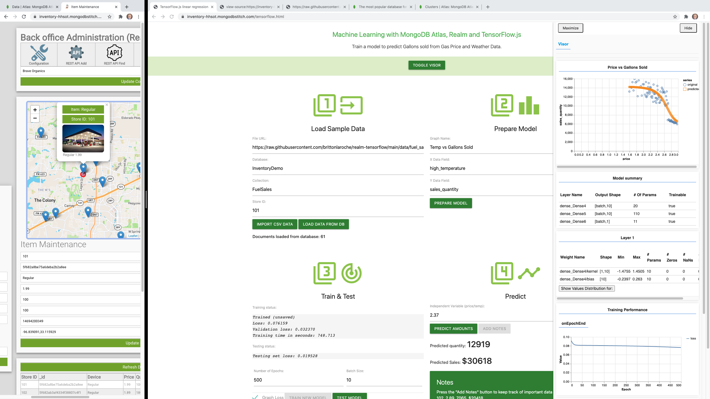</a>|   
   

## Tutorial Contents 
[Overview](#-overview)
1. [Create the Atlas Cluster](#-create-an-atlas-cluster)
2. [Create a Realm Application](#-create-a-realm-application)
3. [Configure a Collection](#-configure-a-collection)
4. [Set up Application Authentication](#-set-up-application-authentication)
5. [Create a Function](#-create-a-function)
6. [Connect to Realm from your client](#-connect-to-realm-from-your-client)
7. [Set up Hosting](#-set-up-hosting)
8. [Time to Play](#-time-to-play)
9. [Save the model after training](#-save-the-model-data-after-training)
10. [Create a trigger to keep a history of the models](#-create-a-trigger-to-keep-a-history-of-the-models)

# Overview

| Why TensorFlow?       | 
|-----------------------|
|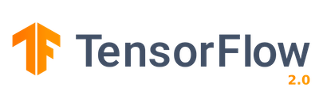    | 
|TensorFlow is an end-to-end open-source platform for machine learning. It has a comprehensive, flexible ecosystem of tools, libraries, and community resources that lets researchers push the state-of-the-art in ML and developers easily build and deploy ML-powered applications. TensorFlow was developed by the Google Brain team for internal Google use. It was released under the Apache License 2.0 on November 9, 2015. In Jan 2019, Google announced TensorFlow 2.0. In May 2019, Google announced TensorFlow Graphics for deep learning in computer graphics. TensorFlow 2.0 became officially available in Sep 2019.|

|Easy model building                            | Robust ML production anywhere                 |  Powerful experimentation for research        |
|-----------------------------------------------|-----------------------------------------------|-----------------------------------------------|
|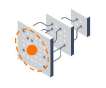               |         |   |
|Build and train ML models easily using intuitive high-level APIs like the layer API, which makes for immediate model iteration and easy debugging.| Easily train and deploy models in the cloud, on-prem, in the browser, or on-device no matter what language you use.|A simple and flexible architecture to take new ideas from concept to code, to state-of-the-art models, and to publication faster.|

## TensorFlow.js      

    
TensorFlow.js is a library for machine learning in JavaScript. Develop ML models in JavaScript, and use ML directly in the browser.  The concept was started by the wildly popular playground application. You can interact with the playground application by clicking the link below:   
   
http://playground.tensorflow.org/   
   
The playground application allows you to build and train a neural network in your browser. Following on the heels of the successful playground application, Google released deeplearn.js in August of 2017 to allow developers to used javascript in the browser to do machine learning.  In April of 2018, Google took what they had learned from deeplearn.js, and released it into the TensorFlow family by officially releasing TensorFlow.js.

I chose TensorFlow.js to showcase the power of machine learning with MongoDB Atlas and Realm in the Browser for the following reasons:
   
__1. Zero Installation:__ No Drivers / No Installations   
__2. Interactive:__ Its Interactive, you can play with the data.   
__3. Sensors:__ It has access to Sensors, Webcams, and Smart Phone Data with standard APIs to access the sensors   
__4. Distributed:__ Data can be processed and remain on the client   
   
For these reasons, I selected TensorFlow.js and the browser for this very powerful lab.  Gone are the days where you had to install a complex Hadoop infrastructure with Spark and write complex functions and logic just to do machine learning.  Today With MongoDB Atlas, Tensorflow.js, and a browser you can do highly interactive machine learning with zero installation and very little complexity.  The barriers to machine learning have been removed.

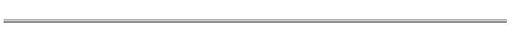   
   
    
## Getting Started
This project uses Tensorflow.js, MongoDB Realm, and Atlas to provide you with everything you need to create a cloud-based machine learning platform with nothing more than a modern web browser, and the determination to begin with some good "old fashioned" human learning.  This short tutorial expects that you know nothing about MongoDB Atlas, Realm, or Machine Learning with Google Tensorflow.    

I chose Tensorflow.js for this project because it is very intuitive, easy to pick up and the results can be seen directly in the web browser with just a few lines of code. I was able to watch a few Tensorflow.js videos and create the first version of this app on a weekend.  It’s only 88 lines of code but it loads sales data from a gas station into MongoDB, creates a Tensorflow model from MongoDB, trains the model, and makes a prediction on how many gallons will be sold based on price.  This first program does all this in just 88 lines of code!

I highly recommend watching the following 3 videos, about 7 minutes each.  It will be the best 21 minutes you can spend to learn all the core concepts.    
   
<a href="https://www.youtube.com/playlist?list=PLs6AluHXaQnjeI6jzDkpKXvbPj31i4GgF" target="videos">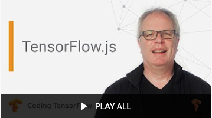</a>   

I also recommend a Udemy course for some deeper learning and good examples and place a link in the final part of this lab.

   
   
   
    
## Why MongoDB?

### Flexible Data Model
MongoDB is one of the best databases for machine learning for a number of reasons.  The first reason is that MongoDB has a flexible schema, unlike a relational database where you have to define a schema and tables with column definitions, MongoDB allows you to load data directly without any upfront schema design.  This means that you can load data from any new source and get to work immediately. In this tutorial, we will build one app that can do machine learning on gas price data, add temperature data, and then load real estate data and do machine learning on house prices without changing one single line of code. 

### Powerful Query Language
Once the data is loaded, MongoDB provides you with a powerful query language and indexes to give you fast access to very specific values that you would want to use. What is more, with MongoDB Atlas you can create a free tier in any of the major cloud providers (AWS, GCP, and Azure) in just 7 minutes. But don't take my word for it, in the next few sections you will literally see for yourself.   

### Store and Retrieve Trained Models as JSON Documents
The final reason MongoDB is a great fit for machine learning is .. it is the perfect place to store, share, and retrieve your trained models.  We will not only store our models but keep a history of our models in the database allowing us to restore a trained model from a previous version if we chose to do so.  Completing this git hub will allow you to create a simple trigger to store a copy of your model in a history collection, and see how easy it is to keep a history of your trained models over time inside MongoDB.   

### MongoDB Atlas offers Database as a Service Across all Modern Cloud Providers
   
On June 28, 2016, MongoDB Atlas was released, it is the simplest, most robust, and most cost-effective way to run MongoDB in the Cloud. Atlas is a database as a service that makes running MongoDB almost effortless, whether you run a single replica set, or a sharded cluster hosting a hundred terabytes. Today, as of Oct 22, 2020, MongoDB Atlas Is The First Cloud Database To Enable Customers To Run Applications Simultaneously On All Major Cloud Providers. Using multi-cloud clusters, customers can easily take advantage of the unique capabilities and reach of different cloud providers. This means customers can take advantage of the benefits of deploying applications across multiple cloud providers without the added operational complexity of managing data replication and migration across clouds.


TensorFlow is an end-to-end open-source platform for machine learning. It has a comprehensive, flexible ecosystem of tools, libraries, and community resources that lets researchers push the state-of-the-art in ML and developers easily build and deploy ML-powered applications. Google claims, __"Robust ML production anywhere. Easily train and deploy models in the cloud, on-prem, in the browser, or on-device no matter what language you use."__   
    
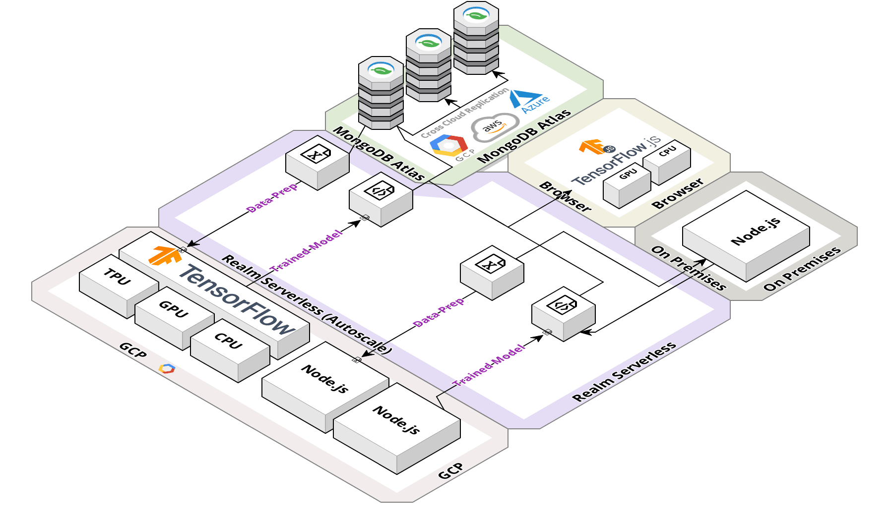   
   
The diagram above depicts how TensorFlow can run in GCP on its own cloud platform allowing you to take advantage of the Tensor Processing Unit, or TPU. The TPU is an AI accelerator application-specific integrated circuit developed by Google specifically for neural network machine learning, particularly using Google's own TensorFlow software. Or staying within the GCP TensorFlow Machine Learning environment,  you can use GPUs or CPUs provided by the google cloud.  Additionally, you can run TensorFlow on a self-hosted Node.js installation inside the google cloud or another cloud provider, or even on-premises.
   
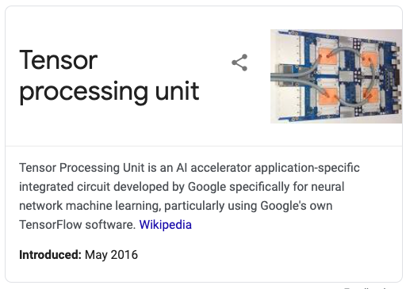  
In May 2016, Google announced its Tensor processing unit (TPU), an application-specific integrated circuit (ASIC, a hardware chip) built specifically for machine learning and tailored for TensorFlow. A TPU is a programmable AI accelerator designed to provide high throughput of low-precision arithmetic (e.g., 8-bit), and oriented toward using or running models rather than training them. Google announced they had been running TPUs inside their data centers for more than a year and had found them to deliver an order of magnitude better-optimized performance per watt for machine learning. In May 2018, Google announced the third-generation TPUs delivering up to 420 teraflops of performance and 128 GB high bandwidth memory (HBM). Cloud TPU v3 Pods offer 100+ petaflops of performance and 32 TB HBM.   
   
__Edge TPU:__ In July 2018, the Edge TPU was announced. Edge TPU is Google's purpose-built ASIC chip designed to run TensorFlow Lite machine learning (ML) models on small client computing devices such as smartphones[21] known as edge computing.
   
Finally, one can run TensorFlow.js in the browser and take advantage of your very own GPU on your laptop or desktop.  This lab was created to run in your own browser and utilize your GPU.  This requires no set up of software, no installation of node.js no configuration of a cloud account (other than Atlas), and requires only a browser and a code editor.
    
In all cases, we use MongoDB Realm and Atlas to prepare the data from the MongoDB Atlas database and to store the trained model for query and future use.
   
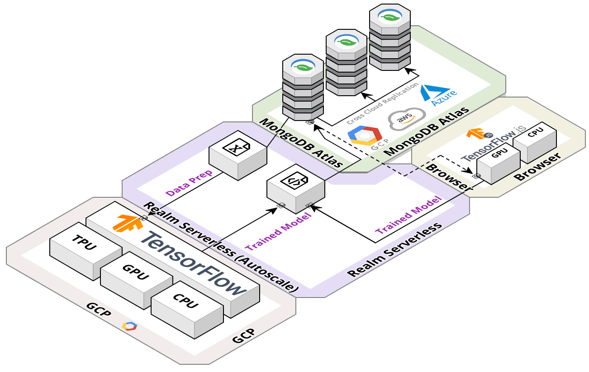   
   
In the diagram above we see the most common application, using GCP for heavy lifting in Google ML on large complex tasks, and the browser for prediction and training small tasks.  Gone are the days of installing a complex Hadoop infrastructure and Spark.  Today we can deploy MongoDB atlas as a service and GCP machine learning as a service and accomplish great things with zero installation and maintenance.   
   
   

## Learning Journey:
If you are new to machine learning and TensorFLow.js,  I recommend the following resources as these guides were used to build this hands-on lab.   
   
[TensorFlow Playground](http://playground.tensorflow.org/)   
[Tensorflow.js videos: 3 videos at 7 minutes each](https://www.youtube.com/playlist?list=PLs6AluHXaQnjeI6jzDkpKXvbPj31i4GgF)   
[Machine Learning with TensorFlow.js: Udemy Course](https://www.udemy.com/course/machine-learning-in-javascript-with-tensorflow-js/)   
    
  
    
##  Create an Atlas Cluster
Our first step is to create an atlas cluster. Create a free tier cluster known as an M0.     


Click the following link https://cloud.mongodb.com to sign up. Additional instructions on creating an Atlas cluster are available here: [Atlas getting started Guide](https://docs.atlas.mongodb.com/getting-started/)  

The easiest way to get started is to authenticate with google if you have a gmail account.  If not you can fill in the form and prvide the email adress of your choosing.   
    
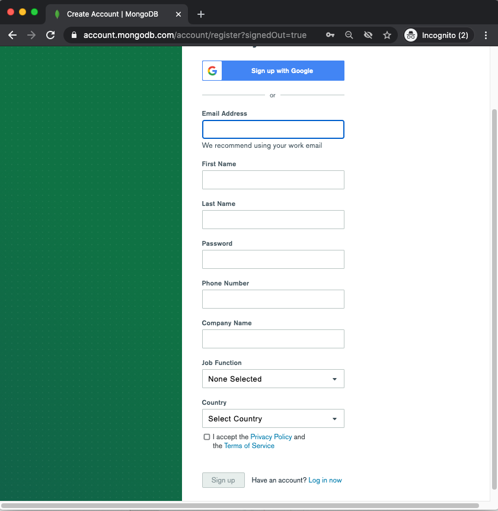   
   
When you create your account you will be asked to create a an organization and a project. You can come up with any number of creative names for your organization. The default project name is __"Project0"__, but I prefer to name it something more meaningful like __"Machine Learning"__.  This is not necessary, but it is good form to clearly identify what your project is. For this lab we will be primarily working with javascript so lets select that option as our prefered language.   
   
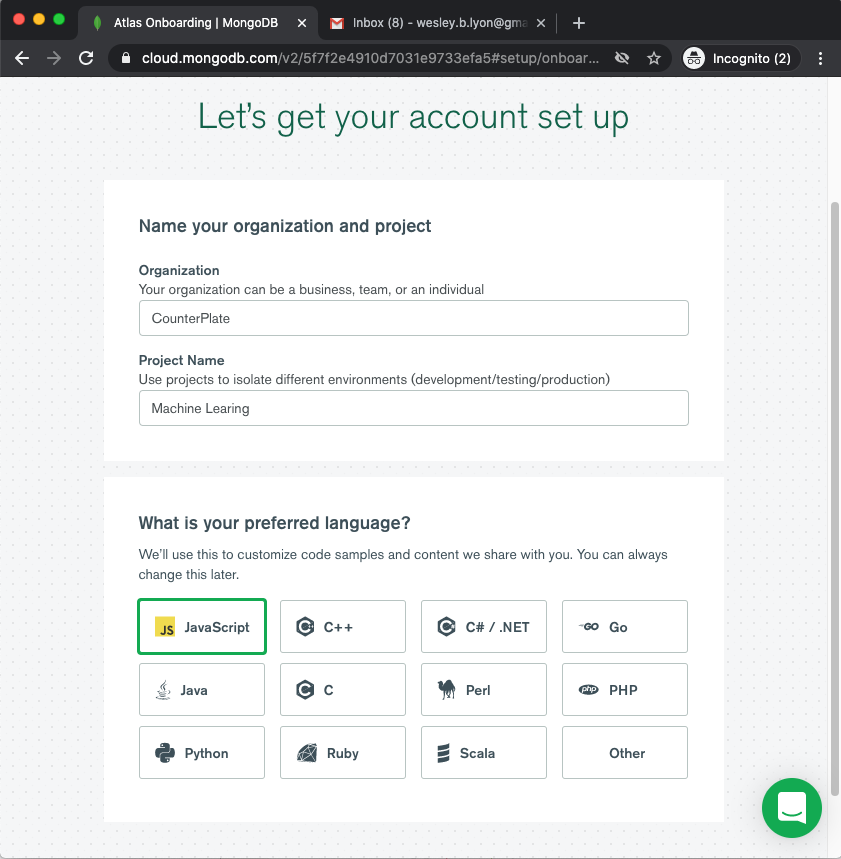   

Now we get a dialog to select the type of cluster we want.  Lets go with __"Shared Clusters"__ on the left because it has a free tier, which is all we need to get started with our first machine learning application.
   
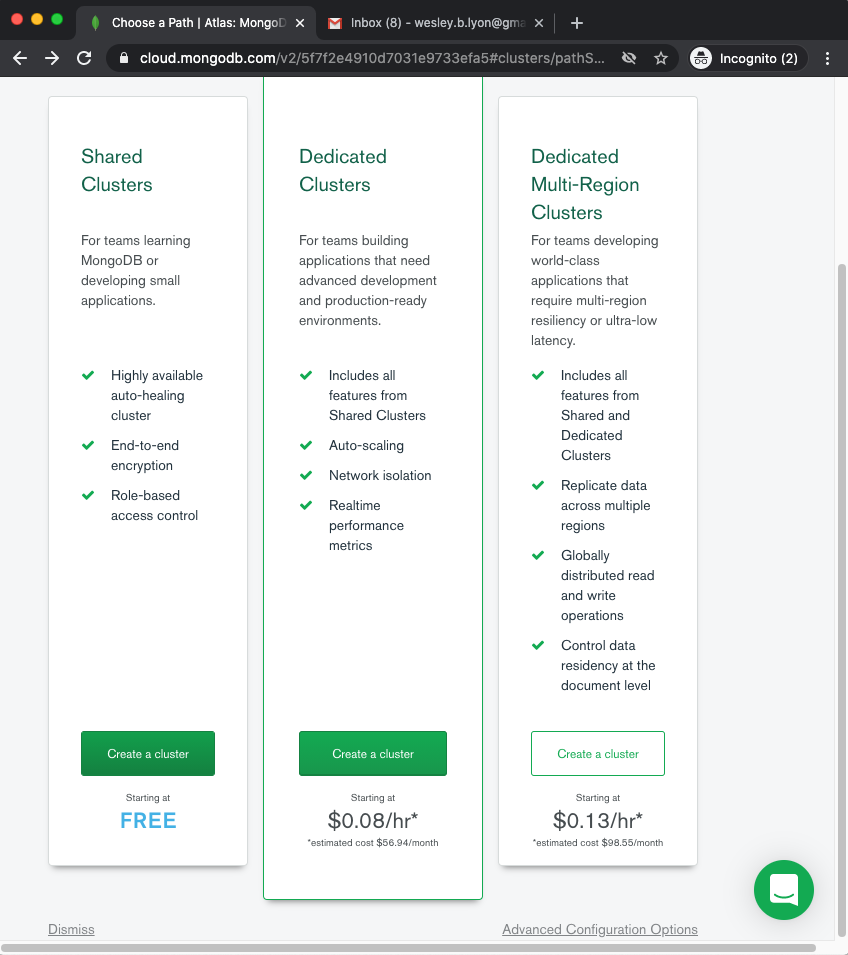   
   

Notice that you can deploy in any of the three major cloud providers (AWS, GCP or Azure).  I went with AWS and the default region. __BE SURE TO CREATE ATLAS VERSION 4.4__   Select version 4.4 from the list of availble versions of Atlas.  Then click the __"Create Cluster"__ button on the bottom right.   
   
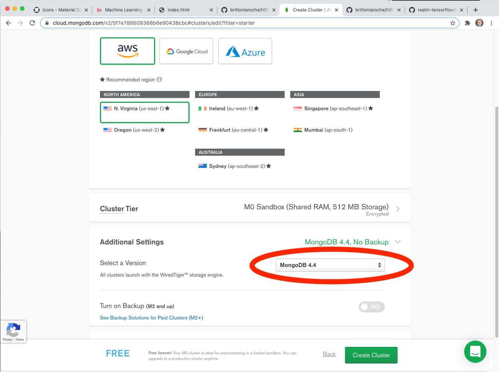   
## Tutorial Contents 
[Overview](#-overview)
1. [Create the Atlas Cluster](#-create-an-atlas-cluster)
2. [Create a Realm Application](#-create-a-realm-application)
3. [Configure a Collection](#-configure-a-collection)
4. [Set up Application Authentication](#-set-up-application-authentication)
5. [Create a Function](#-create-a-function)
6. [Connect to Realm from your client](#-connect-to-realm-from-your-client)
7. [Set up Hosting](#-set-up-hosting)
8. [Time to Play](#-time-to-play)
9. [Save the model after training](#-save-the-model-data-after-training)
10. [Create a trigger to keep a history of the models](#-create-a-trigger-to-keep-a-history-of-the-models)
     
   
   
    

##  Create a Realm Application
Our second step is to create a Realm application.  MongoDB Realm has a number of very cool features. We will be focused on the Realm browser SDK that allows you to connect to MongoDB Atlas through the web browser.  Additionally we will be creating a Realm function that loads data from a CSV file into MongoDB Atlas.  This is imporatnt because once the data is in MongoDB, you can search and filter for specific fields and criteria that make feeding your machine learning model much easier and far more precise.  MongoDB's flexible data model allows you to load data from any CSV file directly into the database with out any need to model the data first.  This project showcases how easy it is to do machine learning with MongoDB.

Open the Atlas console and select the __"Realm"__ tab in the upper middle.  This brings up a dialog to create your first realm application. Select __"Web"__ as the primary application we are building for, and __"No I'm starting from scratch"__ when asked if you are currently using the Realm database.   
   
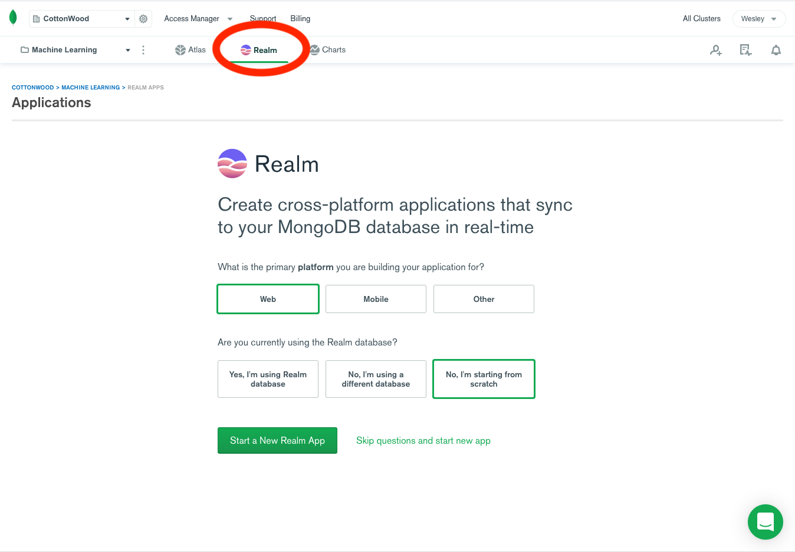   

Give your application a name.  Lets go with __"Tensorflow"__ be sure your newly created cluster is selected.   
   
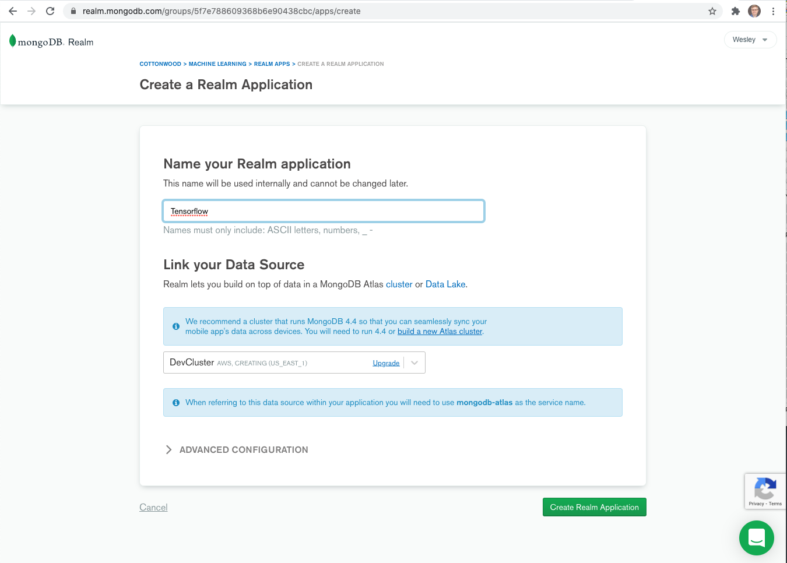   

The application guide pops up, you can close guides or select __"WebSDK"__ as we will be using the web SDK as part of this project.  The guides are helpful for a quick check list of things to do.     
   
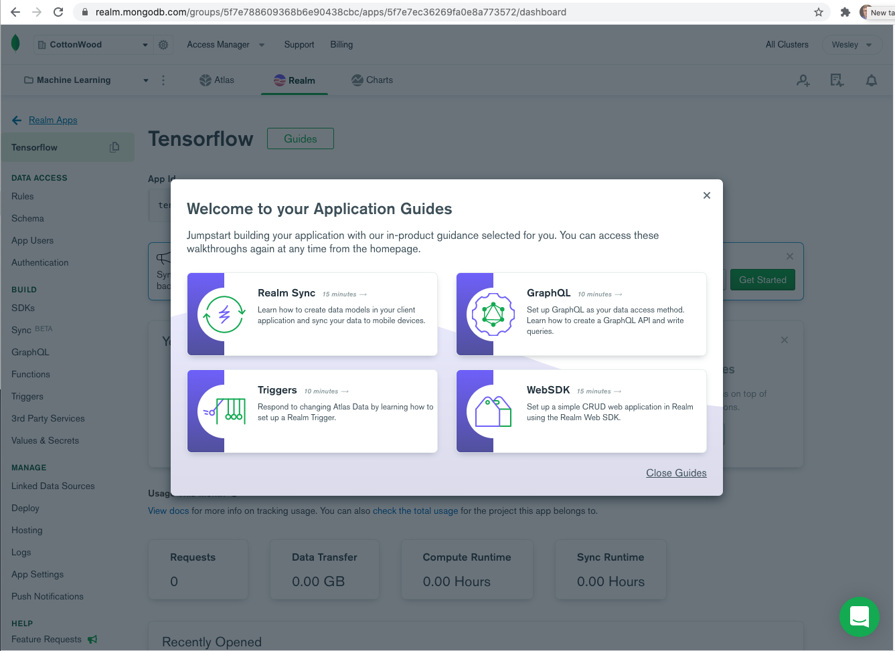   

Take note of the __"App Id"__ circled in red.  Press the copy icon and paste this into your notes for future use.  You can return to this screen at any time in the future.  Notice the guides check list, we will be covering this list next.   
   
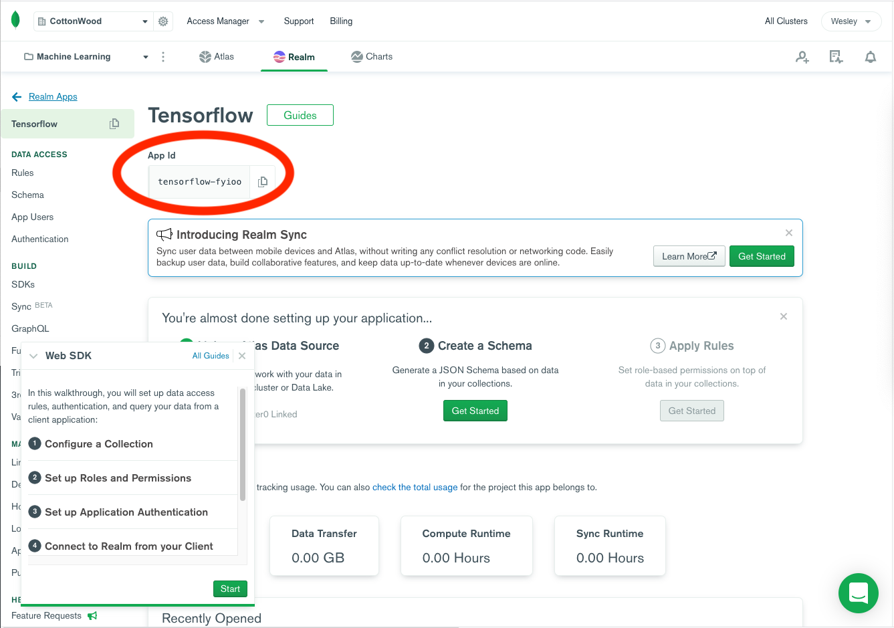   
   
## Tutorial Contents 
[Overview](#-overview)
1. [Create the Atlas Cluster](#-create-an-atlas-cluster)
2. [Create a Realm Application](#-create-a-realm-application)
3. [Configure a Collection](#-configure-a-collection)
4. [Set up Application Authentication](#-set-up-application-authentication)
5. [Create a Function](#-create-a-function)
6. [Connect to Realm from your client](#-connect-to-realm-from-your-client)
7. [Set up Hosting](#-set-up-hosting)
8. [Time to Play](#-time-to-play)
9. [Save the model after training](#-save-the-model-data-after-training)
10. [Create a trigger to keep a history of the models](#-create-a-trigger-to-keep-a-history-of-the-models)
   
   
   
    
##  Configure a Collection
In order to insert data into Atlas we have to configure Realm rules that allow our browser SDK connect.  But first we have to prepare authorization to connect to a specific database and collection.  Lets begin by selecting the __"Rules"__ menu item on the left navigation pane of the Realm console as seen below.  This will bring up a dialog asking us to add a collection.  Click the __"Add Collection"__ button.   
   
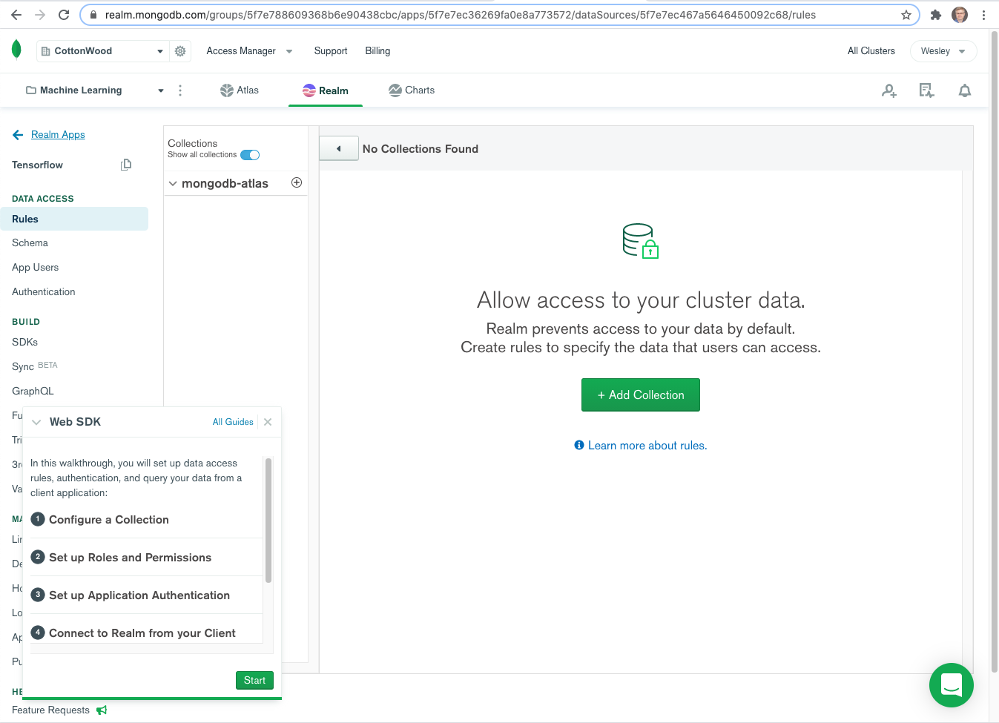   
   
In the add new collection dialog we will be creating authorzation rules for a new database and a new collection.  We have to type in the names manually and select the small dialog box directly below that says __"Create ..."__ as the database and collection do not exist yet.  Type in __"InventoryDemo"__ for the database name and click the __"Create InventoryDemo"__ dialog box.  Then for the collection name type in __"FuelSales"__ and click the __"Create FuelSales"__ dialog box.  We will go with the default __"No template"__ selection for the permissions template and then click the __"Add Collection"__ button on the lower right.   
   
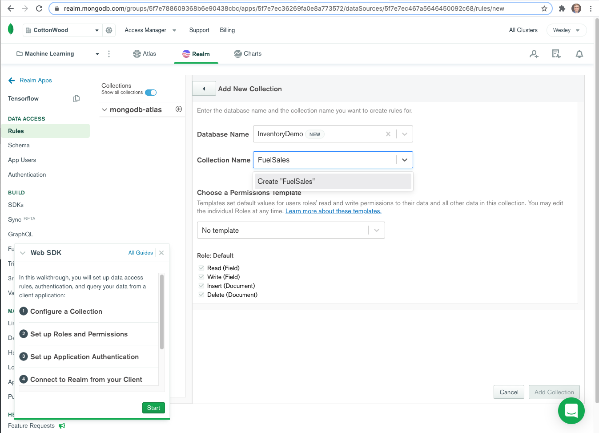   
   
Now we are ready to define the read and write rules for the __"FuelSales"__ collection.  Click the __"Write"__ check box, and it will add the read permission automatically. Press the __"Save"__ button and then __"Review & Deploy"__ your changes.   
   
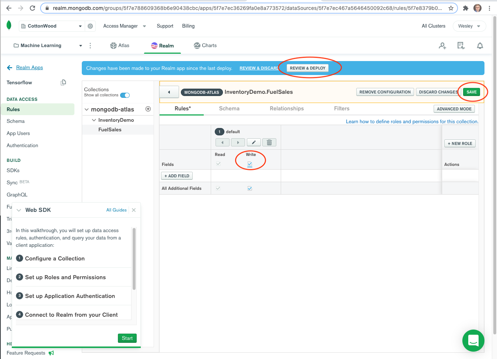   
   
## Tutorial Contents 
[Overview](#-overview)
1. [Create the Atlas Cluster](#-create-an-atlas-cluster)
2. [Create a Realm Application](#-create-a-realm-application)
3. [Configure a Collection](#-configure-a-collection)
4. [Set up Application Authentication](#-set-up-application-authentication)
5. [Create a Function](#-create-a-function)
6. [Connect to Realm from your client](#-connect-to-realm-from-your-client)
7. [Set up Hosting](#-set-up-hosting)
8. [Time to Play](#-time-to-play)
9. [Save the model after training](#-save-the-model-data-after-training)
10. [Create a trigger to keep a history of the models](#-create-a-trigger-to-keep-a-history-of-the-models)
   
   
   
    
##  Set up Application Authentication   
We have given specific authorization rules to a databse collection in the step above.  Now we need to provide an Authentication mechanism for our application.  The easiest way to get started is to allow users to log in Anonymously.  This is accomplised by selecting the __"Authentication"__ menu item from the left navigation pane of the Realm console as seen below.  We can see that the __"Allow users to log in anonymously"__ option has the enabled parameter set to off.  Click the edit button to chnage this value.   
   
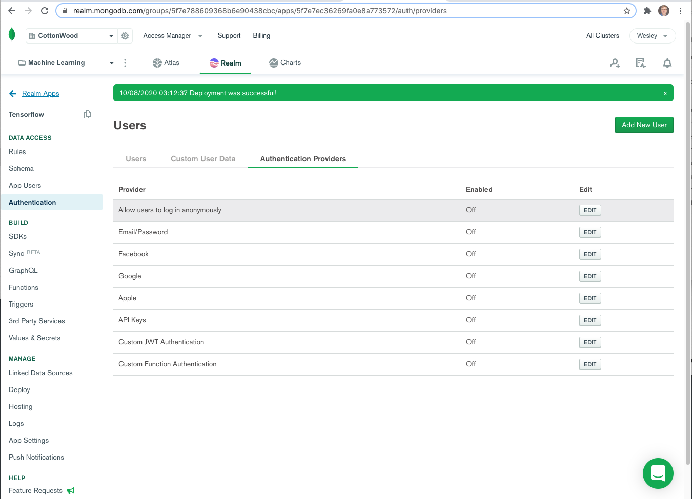   
   
The provider enabled / disabled dialog window appears.  Toggle the permission to __"ON"__ and press the __"Save"__ button to the changes and then remember to __"Review & Deploy"__ your changes.  
   
   
   
## Tutorial Contents 
[Overview](#-overview)
1. [Create the Atlas Cluster](#-create-an-atlas-cluster)
2. [Create a Realm Application](#-create-a-realm-application)
3. [Configure a Collection](#-configure-a-collection)
4. [Set up Application Authentication](#-set-up-application-authentication)
5. [Create a Function](#-create-a-function)
6. [Connect to Realm from your client](#-connect-to-realm-from-your-client)
7. [Set up Hosting](#-set-up-hosting)
8. [Time to Play](#-time-to-play)
9. [Save the model after training](#-save-the-model-data-after-training)
10. [Create a trigger to keep a history of the models](#-create-a-trigger-to-keep-a-history-of-the-models)
   
   
   
    
##  Create a function   
We have created authorization rules for a database collection and set up authentication.  We are now ready to write our first application function.  Begin by selecting the __"Funtions"__ menu item from the left naviagtion pane of the Realm console. Click the __"Create New Function"__ button.
   
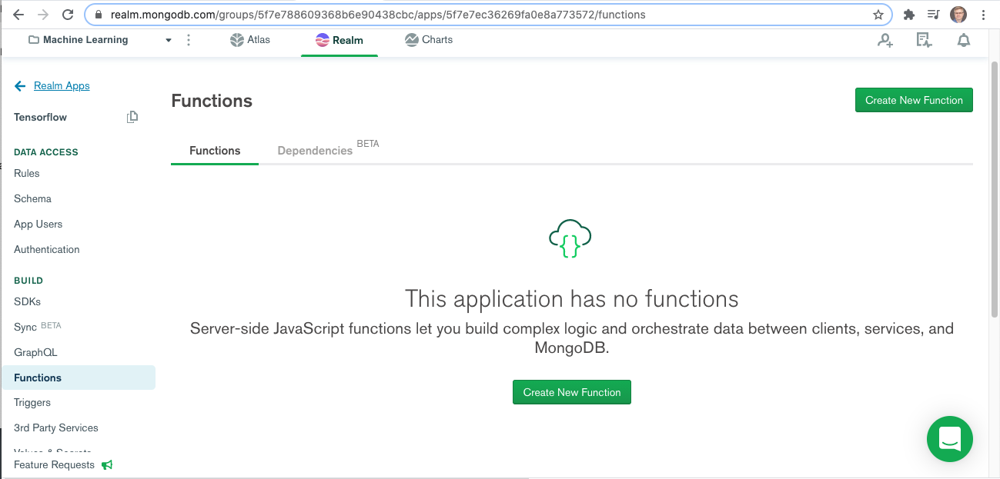   
   
The create function dialog window is presented.  Name the function __"fnc_loadCSV"__ with out the quotes. __BE SURE TO SELECT "SYSTEM" as the AUTHENTICATION METHOD__ Again be user to select the system authentication method for now.  As a future execsize you might try __"Application Authentication"__ later after we create our first application to see what happens!  Click the __"Save"__ button to proceed.   

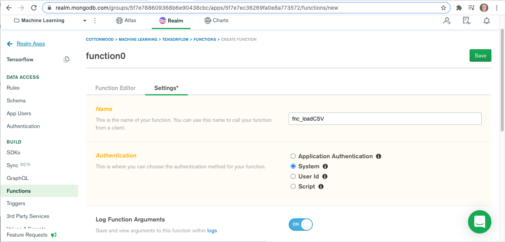   
   
The __"Function Editor"__ dialog window opens.  Here we write the code to our function.  I have taken the liberty of writing the code for you.  This is on par with demo code, and needs to be enhanced and tested if you wish to have a truly robust method of loading in any CSV file. But, its a good start. Copy and paste the code from below into the editor and click __"Save"__ then __"Review & Deploy"__ your changes.

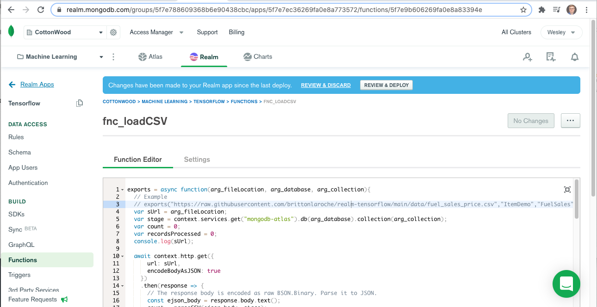   

Copy and paste from the code below.  If you notice errors you should probably cut and paste from the raw github file linked below the code snippet.

```js
exports = async function(arg_fileLocation, arg_database, arg_collection){
  // Example 
  // exports("https://raw.githubusercontent.com/brittonlaroche/realm-tensorflow/main/data/fuel_sales_price.csv","InventoryDemo","FuelSales")
  var sUrl = arg_fileLocation;
  var stage = context.services.get("mongodb-atlas").db(arg_database).collection(arg_collection);
  var count = 0;
  var recordsProcessed = 0;
  console.log(sUrl);
  
  await context.http.get({
      url: sUrl,
      encodeBodyAsJSON: true
    })
    .then(response => {
      // The response body is encoded as raw BSON.Binary. Parse it to JSON.
      const ejson_body = response.body.text();
      count = parseCSV(ejson_body, stage);
      console.log("number of docs processed: "+ count);
    })
   //remove the count for the header record
   recordsProcessed = parseFloat(count -1);
   return count;
};
async function parseCSV(csv, stage){
  //remove quotes and phrases
  csv = csv.replace(/"/g,"");
  var nDate = new Date();
  var lines=csv.split("\n");
  
  //delete previous data
  stage.deleteMany({});
  var result = [];
  var headers=lines[0].split(",");
  var locDoc = {}
  //console.log( "headers: " + JSON.stringify(headers));
 
  //Stage all data
  var parsed = ""
  for(var i=1;i<lines.length;i++){
	  var stageObj = {};
	  var currentline=lines[i].split(",");
	  for(var j=0;j<headers.length;j++){
	    parsed = parseFloat(currentline[j]);
	    if (isNaN(parsed) || headers[j] === "date"){
		    stageObj[headers[j]] = currentline[j];
	    } else  {
	      stageObj[headers[j]] = parseFloat(currentline[j]);
	    }
	  }
	  result.push(stageObj);
  }
  stage.insertMany(result);
  return lines.length; 
}
```

The source code to the fucntion is available here on github under the HTML directory and in the link below:   
https://github.com/brittonlaroche/realm-tensorflow/blob/main/html/fnc_loadCSV.js  

Also notice that you can load your own CSV file by uploaing it into git hub and then getting the link to the __"RAW"__ file. Paste the new link into the html file for teh function call and you will be loading your own data set.  The function handles strings and numbers only.  It makes one exception for a field labled __"date"__ which it will treat as a string.   

__NOTE: it has to be the RAW file or it won't load correctly!!!__

https://raw.githubusercontent.com/brittonlaroche/realm-tensorflow/main/data/fuel_sales_price.csv
   
## Tutorial Contents 
[Overview](#-overview)
1. [Create the Atlas Cluster](#-create-an-atlas-cluster)
2. [Create a Realm Application](#-create-a-realm-application)
3. [Configure a Collection](#-configure-a-collection)
4. [Set up Application Authentication](#-set-up-application-authentication)
5. [Create a Function](#-create-a-function)
6. [Connect to Realm from your client](#-connect-to-realm-from-your-client)
7. [Set up Hosting](#-set-up-hosting)
8. [Time to Play](#-time-to-play)
9. [Save the model after training](#-save-the-model-data-after-training)
10. [Create a trigger to keep a history of the models](#-create-a-trigger-to-keep-a-history-of-the-models)
   
   
   
    
##  Connect to Realm from your Client   

We are now ready to create our first machine learning application.  In the code below we see that we are including two main javascript libraries that have all the fuctions we need. One is for Mongo DB Realm and the other is for Tensorflow.    

```js
<script src="https://unpkg.com/realm-web@0.9.0/dist/bundle.iife.js"></script>
<script src="https://cdn.jsdelivr.net/npm/@tensorflow/tfjs/dist/tf.min.js"></script>
```

Cut and paste the file contents below into your code editor.  If you don't have a code editor I recommend vscode you can get it here: https://code.visualstudio.com/download   
   
Save the file in your working directory as __"firstVersion.html"__  We need to make one change to the application to get it to work, and that it to add your reaml application id that we created in step 2.  Replace __"YOUR-APP-ID"__ with the value copied from the realm console.  Then save the file and double click it to open it in the broswer.

```js
const appId = "YOUR-APP-ID"; // Set Realm app ID here.
```

https://raw.githubusercontent.com/brittonlaroche/realm-tensorflow/main/html/firstVersion.html

```js
<html>
<head>
<!-----------------------------------------------------------------------------------------------------------------
-- Version  Date          Author                Comments          
-------------------------------------------------------------------------------------------------------------------
-- 1.0      10/05/2020    Britton LaRoche       Initial Version
--
-------------------------------------------------------------------------------------------------------------------
-->
<script src="https://unpkg.com/realm-web@0.9.0/dist/bundle.iife.js"></script>
<script src="https://cdn.jsdelivr.net/npm/@tensorflow/tfjs/dist/tf.min.js"></script>
<script>
  const appId = "YOUR-APP-ID"; // Set Realm app ID here.
  const appConfig = {
    id: appId,
    timeout: 1000,
  };
  async function run() {
    let user;
    try {
      const app = new Realm.App(appConfig);
      const credentials = Realm.Credentials.anonymous(); // create an anonymous credential
      user = await app.logIn(credentials);
      console.dir(user);
      result = await user.functions.fnc_loadCSV("https://raw.githubusercontent.com/brittonlaroche/realm-tensorflow/main/data/fuel_sales_price.csv","InventoryDemo","FuelSales");
      console.dir(result);
      const mongo = app.services.mongodb("mongodb-atlas");
      const db = mongo.db("InventoryDemo");
      const coll = db.collection("FuelSales");
      items = await coll.find({});
      console.log("Items Length: " + items.length);
      console.dir(items);

      //---------------------------------------------------------
      //-- Data prep
      //---------------------------------------------------------

      var numDocs = items.length;
      var xInput =[];
      var yOutput = [];
      var priceTemp = [];
      var totalSales = 0;
      for  (i=0;i<numDocs;i++){
        //priceTemp = [items[i].price, items[i].high_temperature];
        //totalSales = items[i].sales_total;
        xInput[i] = items[i].price;
        yOutput[i] = items[i].sales_quantity;
      }

      //---------------------------------------------------------
      //-- Tensor flow / ML Prediction Below
      //---------------------------------------------------------

      // Define a model for linear regression.
      const model = tf.sequential();
      model.add(tf.layers.dense({units: 1, useBias: true, activation: 'linear', inputShape: [1]}));

      model.compile({loss: 'meanSquaredError', optimizer: 'sgd'});

      // Generate some synthetic data for training.
      //const xs = tf.tensor2d([1, 2, 3, 4], [4, 1]);
      //const ys = tf.tensor2d([1, 3, 5, 7], [4, 1]);
      console.dir(xInput);
      console.dir(yOutput);
      const xs = tf.tensor2d(xInput, [numDocs, 1]);
      const ys = tf.tensor2d(yOutput, [numDocs, 1]);


      // Train the model using the data.
      model.fit(xs, ys, {epochs: 100}).then(() => {
          // Use the model to do inference on a data point the model hasn't seen before:
          model.predict(tf.tensor2d([3.25], [1, 1])).print();
          // Open the browser devtools to see the output
      });
    } finally {
      if (user) {
        user.logOut();
      }
    }
  }
  run().catch(console.dir);
</script>
<p>Check the console</p>
Collapse
</head>
<body>
</body>
</html>
```

When you double click the application it will open in the browser.  It will connect to MongDB and load the FuelSales collection from the CSV file located in the data directory of this git hub.  Then it will query the data from the database, prepare the data, train the model and make a prediction.  You can see the results by opening the developer tools and looking at the console.

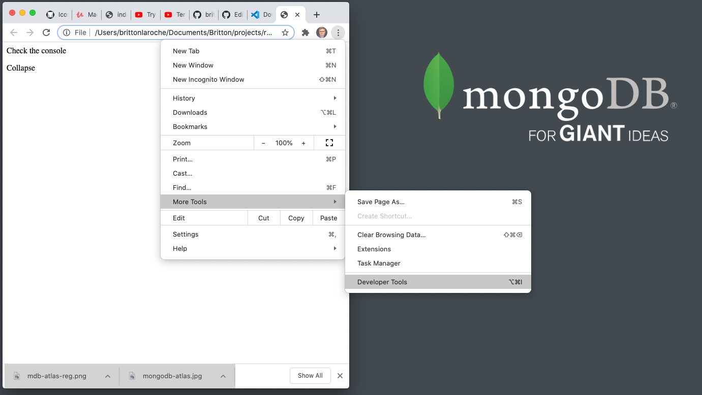   
   
We see that a prediction was made at the very end.  Opening the first array of values shows how the fnc_loadCSV function we created translated each row of the CSV file to a JSON document.  Each value in the first array is a document.   
   
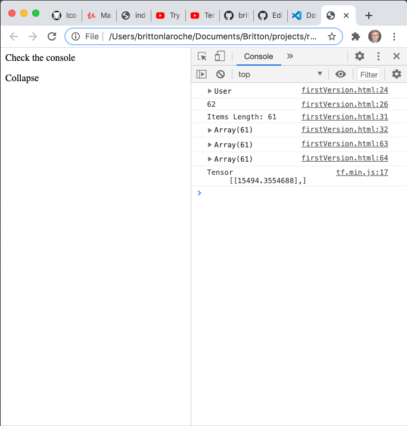   
   
The last value is the predicted amount of gas sales in gallons, and its not correct.  The current model expects to sell more gas at the higher the price.  Change the epochs value from 100 to 5000 and let the model train more.  Each epoch is a cycle through the entire data set using mean squared error to determine the distance from a line it thinks fits the data best.  Each epoch refines the model more during the training process.

```
model.fit(xs, ys, {epochs: 100}).then(() => {
```   

Changing the epochs value to 5000 looks like the following
   
```
model.fit(xs, ys, {epochs: 5000}).then(() => {
```   
   
After you save the change, refersh the page.  It will take longer to run but the prediction of how much gas you can sell at $3.25 when the price is closer to $1.89 should be much lower than the first predition.  You've just written your first machine learning program and modified the model training to produce a more realistic result.

You can see the data loaded into MongoDB by using the Atlas collection browser.  Click the __"Atlas"__ tab in the realm console to see a view of your cluster for the project, then click the __"Collections"__ button in the middle.
   
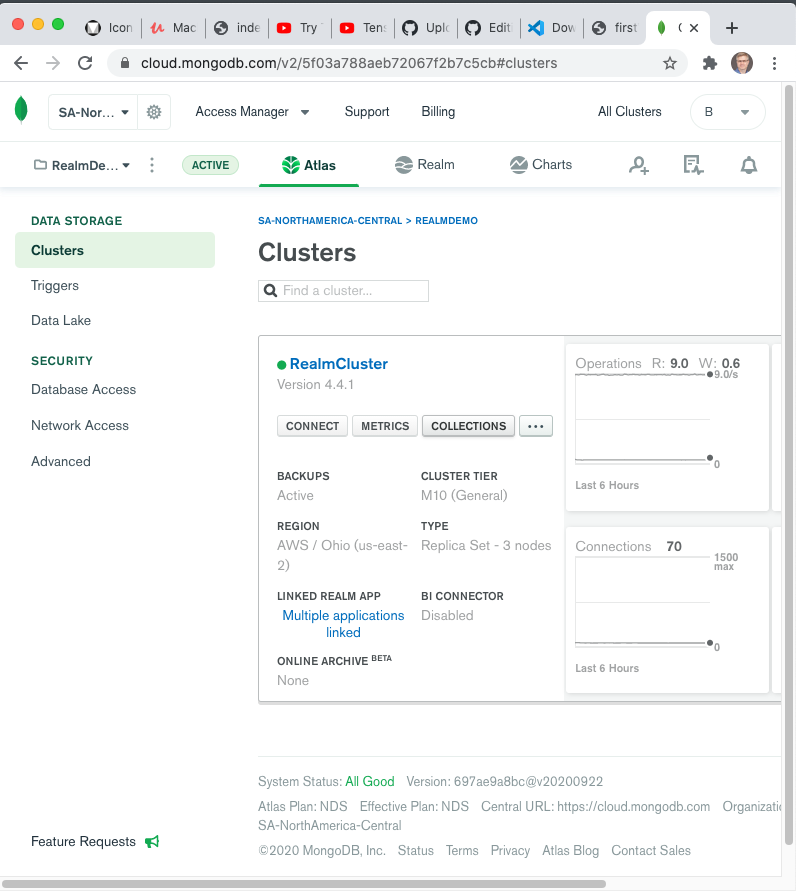   
    
When we click the __"Collections"__ button it should show us our __"InventoryDemo"__ database and all the documents in the __"FuelSales"__ collection.   
    
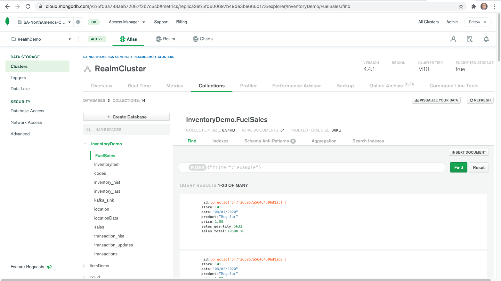   

Be sure to study the code as it is very simple but has all the elements in just a few lines of code.  Next we will use a more complex version in the links below.   

https://github.com/brittonlaroche/realm-tensorflow/blob/main/html/secondVersion.html   
https://github.com/brittonlaroche/realm-tensorflow/blob/main/html/index.html   
   
Copy the contents of these file and save it as secondVersion.html and index.html respectively. Change the following line (around line 26) to your app id.  Your application ID is the ID we copied in step 2:   

```js
const appId = "YOUR-APP-ID"; // Set Realm app ID here.
```
Save the files and then double click each file to view it.   
   
## Tutorial Contents 
[Overview](#-overview)
1. [Create the Atlas Cluster](#-create-an-atlas-cluster)
2. [Create a Realm Application](#-create-a-realm-application)
3. [Configure a Collection](#-configure-a-collection)
4. [Set up Application Authentication](#-set-up-application-authentication)
5. [Create a Function](#-create-a-function)
6. [Connect to Realm from your client](#-connect-to-realm-from-your-client)
7. [Set up Hosting](#-set-up-hosting)
8. [Time to Play](#-time-to-play)
9. [Save the model after training](#-save-the-model-data-after-training)
10. [Create a trigger to keep a history of the models](#-create-a-trigger-to-keep-a-history-of-the-models)

   
   
    
##  Set up Hosting
MomgoDB Realm allows you to host your application in a servelrss fashion.  You can upload your HTML files created in this lab and have them hosted on the web so you can send the link to others and they can see your project.  By default we provide a URL that can be mapped to your companies DNS the documentation on how to change the URL is provided in the hosting console.   
   
Prepare all your files (firestVersion.html, secondVersion.html, and index.html)  by opening them and adding your application id to the following line:   
   
```js
const appId = "YOUR-APP-ID"; // Set Realm app ID here.
```   
   
Begin by selecting the __"Hosting"__ menu item on the left navigation pane.  If necessary click the __"Enable Hosting"__ button.  Then click the __"Upload"__ button and select the index.html and firstVersion.html.  Then __"Review & Deploy"__ the application hosting changes.  You can now access your app at the url provided.

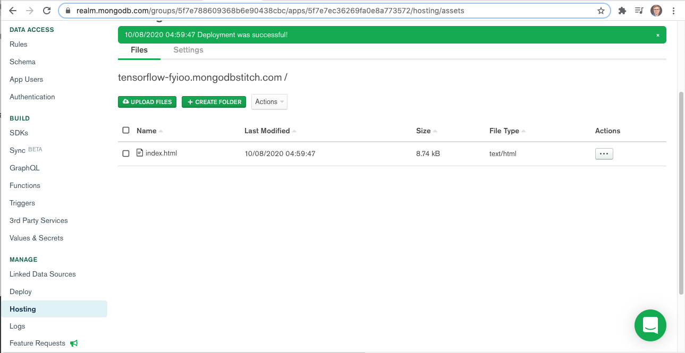   
    
## Tutorial Contents 
[Overview](#-overview)
1. [Create the Atlas Cluster](#-create-an-atlas-cluster)
2. [Create a Realm Application](#-create-a-realm-application)
3. [Configure a Collection](#-configure-a-collection)
4. [Set up Application Authentication](#-set-up-application-authentication)
5. [Create a Function](#-create-a-function)
6. [Connect to Realm from your client](#-connect-to-realm-from-your-client)
7. [Set up Hosting](#-set-up-hosting)
8. [Time to Play](#-time-to-play)
9. [Save the model after training](#-save-the-model-data-after-training)
10. [Create a trigger to keep a history of the models](#-create-a-trigger-to-keep-a-history-of-the-models)
    
   
   
    
##  Time to Play!   
   
A second version of this example is here with a number of graphical elements.   This example uses tfvis to display graphs while the model is trained.   

The udemy course I recommend is https://www.udemy.com/course/machine-learning-in-javascript-with-tensorflow-js/learn/lecture/15381100#overview   
This course allowed me to create the file below.
   
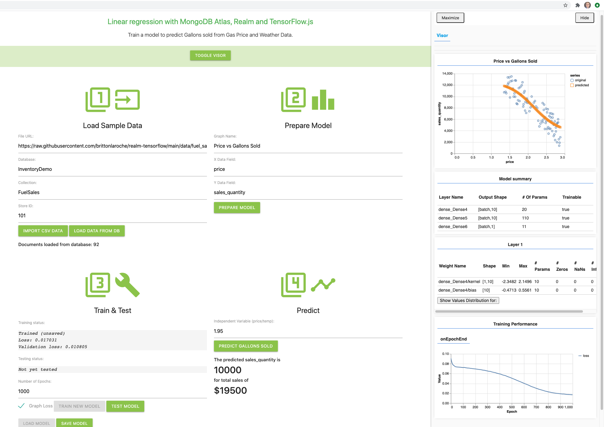   


https://github.com/brittonlaroche/realm-tensorflow/blob/main/html/secondVersion.html   

If you added your application id and uploaded the file to your hosted directory then you should be able to view the file (change your-app-id to your appID from step 2) at:   
https://your-app-id.mongodbstitch.com/secondVersion.html


When you open the file you should be able to play with the data and train the model by adding more epochs.  Watch what happens when you run the model for 1,000 epochs.  You should see the prediction line begin to match the data.
 
## Tutorial Contents 
[Overview](#-overview)
1. [Create the Atlas Cluster](#-create-an-atlas-cluster)
2. [Create a Realm Application](#-create-a-realm-application)
3. [Configure a Collection](#-configure-a-collection)
4. [Set up Application Authentication](#-set-up-application-authentication)
5. [Create a Function](#-create-a-function)
6. [Connect to Realm from your client](#-connect-to-realm-from-your-client)
7. [Set up Hosting](#-set-up-hosting)
8. [Time to Play](#-time-to-play)
9. [Save the model after training](#-save-the-model-data-after-training)
10. [Create a trigger to keep a history of the models](#-create-a-trigger-to-keep-a-history-of-the-models)
    
   
   
    
##  Save the model data after training
   
Now that we have spent the time to train our models it would be great to be able to save them, not just locally but to MongoDB Atlas to share our models with everyone, so they could use or models to make predictions with out having to spend all the time we did training them.

To save the model we need to create a webhook, a REST API endpoint to send a JSON document to MongoDB.  Click the __"3RD Party Services"__ menu item on the left navigation pane of the realm console.  Add a new service and name it __"saveTFModel"__.  Next create the webhook and name it __"SaveTFModelWH"__.  Make sure the webhook runs as system, so we don't have to configure any rules for the collection.   
   
You can decide to log function arguments by toggling the control to __"ON"__ and its a good idea when testing the function for the first time.  Take note of the webhook URL and copy it for future use in the index.html.   
   
The HTTP Method will be __"POST"__ as we will be sending the model as a JSON document.

Be sure to __"Respond With Result"__ by toggling this paramter to ON, so that we can be sure the model was saved to Atlas. 
    
### Save TF Model Web Hook   
   
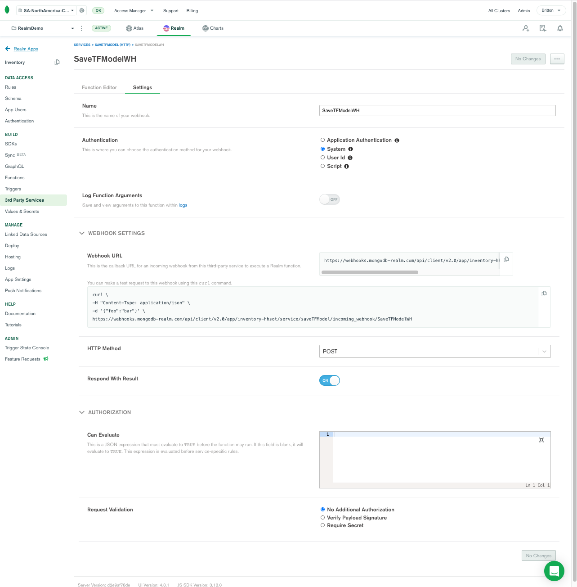   
    
Now we need to make sure we add the function for the Webhook's request editor.  Once teh webhook is saved the function editor should appear.  You can always get to the function editor by pressing the __"Function Editor"__ tab right next to the __"Settings Tab"__.  Cut and paste the code below.  Save the changes and then be sure to __"Review and Deploy"__ changes.
   
```js
// This function is the webhook's request handler.
exports = async function(payload, response) {
  /*===============================================================
  - Date:       Author:           Version:        Notes:
  -----------------------------------------------------------------
  - 2020-10-15  Britton LaRoche   1.0            Initial Release
  -
  ===============================================================*/
    // Data can be extracted from the request as follows:
    console.log(JSON.stringify("SaveTFModelWH called ... executing..." ));
    var model = context.services.get("mongodb-atlas").db("InventoryDemo").collection("tfModel");
    var body = {};
    var result = {};
    if (payload.body) {
      console.log(JSON.stringify(payload.body));
      body = EJSON.parse(payload.body.text());
      console.log("body: " + JSON.stringify(body));
      var myFileName = body.fileName;
      if (myFileName) {
        //remove the old model data
        await model.deleteMany({"fileName":myFileName});
      } else {
        return {"error":"unable to store tensorflow model without fileName"};
      }
      result = await model.insertOne(body);
      console.log(JSON.stringify("return document" ));
      console.log(JSON.stringify(result));
    } else {
      console.log(JSON.stringify("No payload body." ));
      const payloadText = JSON.stringify(payload);
      model.insertOne({"payload": payloadText});
    }
    return  result; 
};
```   

Repeat the process above by creating a new 3rd Party Service called __"getTFModel"__ and then create a webhook named __"getTFModelWH"__.  Follow the steps above to configure your webhook, and cut and paste the function below into the function for the Webhook's request editor.

### Get TF Model Web Hook
   
```js
// This function is the webhook's request handler.
exports = async function(payload, response) {
  /*===============================================================
  - Date:       Author:           Version:        Notes:
  -----------------------------------------------------------------
  - 2020-10-15  Britton LaRoche   1.0            Initial Release
  -
  ===============================================================*/
    // Data can be extracted from the request as follows:
    console.log(JSON.stringify("getTFModelWH called ... executing..." ));
    var model = context.services.get("mongodb-atlas").db("InventoryDemo").collection("tfModel");
    var body = {};
    var result = {};
    if (payload.body) {
      console.log(JSON.stringify(payload.body));
      body = EJSON.parse(payload.body.text());
      console.log("body: " + JSON.stringify(body));
      var bodyDoc = JSON.parse(body);
      console.log("bodyDoc: " + JSON.stringify(bodyDoc));
      var myFileName = bodyDoc.fileName;
      if (myFileName) {
        console.log("fileName: " + myFileName);
      } else {
        return {"error":"unable to retrieve tensorflow model without fileName"};
      }
      result = await model.findOne({"fileName": myFileName});
      console.log(JSON.stringify("return document" ));
      console.log(JSON.stringify(result));
    } else {
      console.log(JSON.stringify("No payload body." ));
    }
    return  result; 
};

```
Save your changes and then __"Review and Deploy"__ your changes.  Next we will edit the index.html to add in the webhook end points we just created.   
   
https://github.com/brittonlaroche/realm-tensorflow/blob/main/html/index.html


Open the index.html file amd replace the following code __'YOUR-SAVE-MODEL-WEBHOOK"__ with the __"WebHook URL"__ you copied by clicking the copy icon into the index.html page around line 287.
```js
        var webhook_url = 'YOUR-SAVE-MODEL-WEBHOOK';
```   

Open the index.html file amd replace the following code __'YOUR-RETRIEVE-MODEL-WEBHOOK"__ with the __"WebHook URL"__ you copied by clicking the copy icon into the index.html page around line 311.
```js
        var webhook_url = 'YOUR-RETRIEVE-MODEL-WEBHOOK';
```   
    
Once you have made the changes to the index.html file, go back to the __"Hosting"__ menu item on the left navigation panel.  When the hosting panel opens, press the upload button and uplaod your index.html file. Then __"Review and Deploy"__ your changes.  You should now be able to train a model and save it to the MongoDB atlas database.  You can see the saved model in the tfModel collection.

## Tutorial Contents 
[Overview](#-overview)
1. [Create the Atlas Cluster](#-create-an-atlas-cluster)
2. [Create a Realm Application](#-create-a-realm-application)
3. [Configure a Collection](#-configure-a-collection)
4. [Set up Application Authentication](#-set-up-application-authentication)
5. [Create a Function](#-create-a-function)
6. [Connect to Realm from your client](#-connect-to-realm-from-your-client)
7. [Set up Hosting](#-set-up-hosting)
8. [Time to Play](#-time-to-play)
9. [Save the model after training](#-save-the-model-data-after-training)
10. [Create a trigger to keep a history of the models](#-create-a-trigger-to-keep-a-history-of-the-models)
   
   
   
    
##  Create a trigger to keep a history of the models
    
What happens if I train a model for 5,000 epochs and then save the model, and somone overwrites my model with 100 epochs?  No worries.  One of the things we can do is gove your model a unique name.  Another thing we can do is keep a history of the models as they change over time.  To keep a history of models in MongoDB Atlas, we can create a trigger on the tfModel collection.  Any time an insert or update or replace occurs we can insert a copy of the model into the tfModel_hist collection.

We begin the process by selecting the __"Triggers"__ menu item from the left navigation pane.  In the add trigger window we select the trigger type to be a __"Database"__ trigger and we give the trigger a name __"trg_tfModel"__.  We set the trigger to __"Enabled"__.  We select the __"InventoryDemo"__ database and the __"tfModel"__ collection.  We will fire the trigger for any __"Insert"__, __"Update"__ or __"Replace"__ of a document.

   
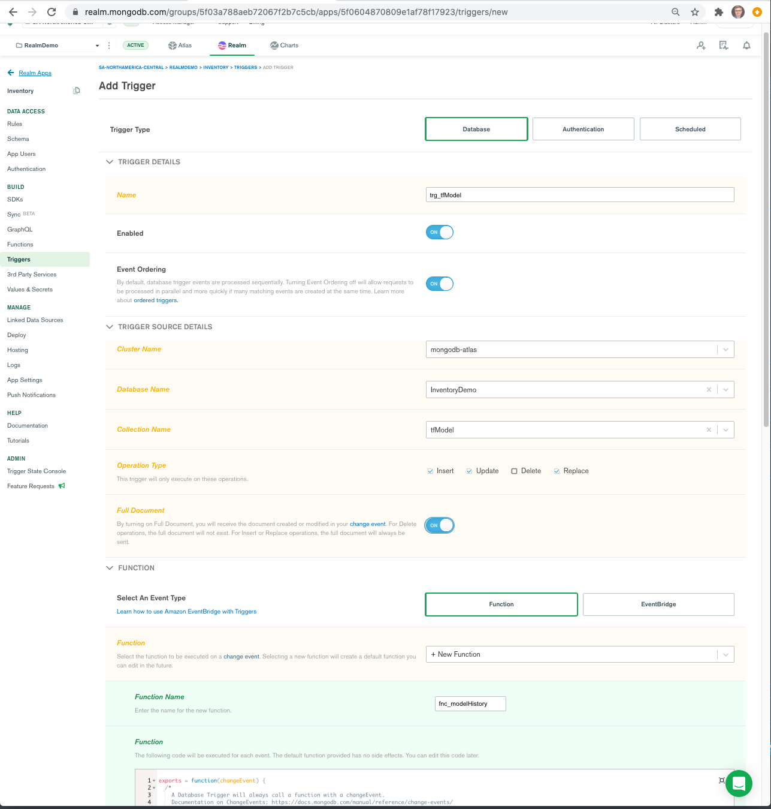  


Next we select the __"Function"__ event type and create a __"+ New Function"__ we give the function a name __"fnc_ModelHistory"__ and then copy and paste the code below:   
   
Paste the following function code into the function editor of the trigger:   
```js
exports = function(changeEvent) {
  const history = context.services.get("mongodb-atlas").db("InventoryDemo").collection("tfModel_hist");
  const fullDocument = changeEvent.fullDocument;
  
  //Take the object_id and make it the parent_id
  //Remove the object_id for a new one in the history collection
  var fullCopy = fullDocument;
  fullCopy.parent_id = fullDocument._id;
  delete fullCopy._id;
  
  // add a date saved to this model in the history collection
  var nDate = new Date();
  fullCopy.date = nDate;
  
  history.insertOne(fullCopy);

};
```   
   
   
Now we save the changes and __"Review and Deploy"__ the changes.  Now when we insert a new model a copy is placed in the tfModel_hist collection.  We can now overide any new model with a copy of a previous model.

## Tutorial Contents 
[Overview](#-overview)
1. [Create the Atlas Cluster](#-create-an-atlas-cluster)
2. [Create a Realm Application](#-create-a-realm-application)
3. [Configure a Collection](#-configure-a-collection)
4. [Set up Application Authentication](#-set-up-application-authentication)
5. [Create a Function](#-create-a-function)
6. [Connect to Realm from your client](#-connect-to-realm-from-your-client)
7. [Set up Hosting](#-set-up-hosting)
8. [Time to Play](#-time-to-play)
9. [Save the model after training](#-save-the-model-data-after-training)
10. [Create a trigger to keep a history of the models](#-create-a-trigger-to-keep-a-history-of-the-models)


