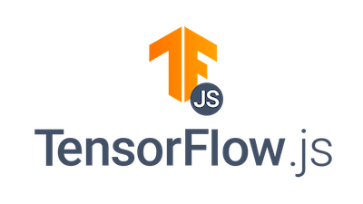
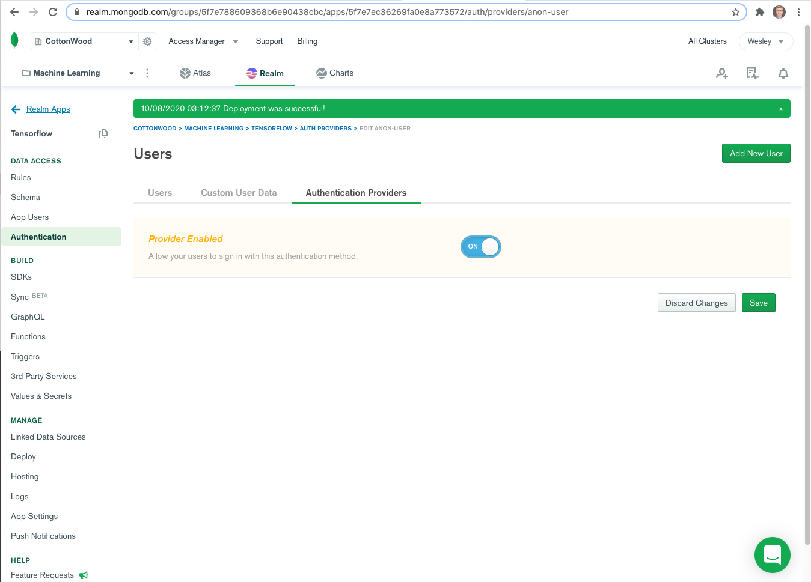

# realm-tensorflow

The following Hands on Lab will allow you to create your first machine learning program with nothing more than a text editor and a browser.  Dpending on your familiarity with MongoDB and basic coding, the lab can be anywhere from 60 to 90 minutes in total. I chose MongoDB and Tensorflow for the ease of setup, flexibility and full set of features. Buckle up, its a fun ride!  

| Why TensorFlow?       | 
|-----------------------|
|    | 
|TensorFlow is an end-to-end open source platform for machine learning. It has a comprehensive, flexible ecosystem of tools, libraries and community resources that lets researchers push the state-of-the-art in ML and developers easily build and deploy ML powered applications. |

|Easy model building                            | Robust ML production anywhere                 |  Powerful experimentation for research        |
|-----------------------------------------------|-----------------------------------------------|-----------------------------------------------|
|               |         |   |
|Build and train ML models easily using intuitive high-level APIs like the layer API, which makes for immediate model iteration and easy debugging.| Easily train and deploy models in the cloud, on-prem, in the browser, or on-device no matter what language you use.|A simple and flexible architecture to take new ideas from concept to code, to state-of-the-art models, and to publication faster.|

## TensorFlow.js      

    
TensorFlow.js is a library for machine learning in JavaScript. Develop ML models in JavaScript, and use ML directly in the browser   

## Getting Started
This project uses Tensorflow.js, MongoDB Realm and Atlas to provide you with everything you need to create a cloud based machine learning platform with nothing more than a modern web browser, and the determination to begin with some good "old fashioned" human learning.  This short tutorial expects that you know nothing about MongoDB Atlas, Realm or Machine Learning with Google Tensorflow.    

I chose Tensorflow.js for this project because it is very intuitive, easy to pick up and the results can be seen directly in the web browser with just a few lines of code. I was able to watch a few Tensorflow.js videos and create the first version of this app in a weekend.  Its only 88 lines of code but it loads sales data from a gas station into MongoDB, creates a Tensorflow model from MongoDB, trains the model, and makes a prediction on how many gallons will be sold based on price.  This first program does all this in just 88 lines of code!

I highly recommend watching the followng 3 videos, about 7 minutes each.  It will be the best 21 minutes you can spend to learn all the core concepts.    
   
<a href="https://www.youtube.com/playlist?list=PLs6AluHXaQnjeI6jzDkpKXvbPj31i4GgF" target="videos"></a>   

I also recommend a Udemy course for some deeper learning and good examples and place a link in the final part of this lab.

## Why MongoDB?
MongoDB is the best database for machine learning for a number of reasons.  The first reason is that MongoDB has a flexible schema, unlike a relational database where you have to define a schema and tables with column definitions, MongoDB allows you to load data directly with out any upfront schema design.  This means that you can load data form any new source and get to work immediately.    
         
Once the data is loaded, MongoDB provides you with a powerful query language and indexes to give you fast access to very specific values that you would want to use. What is more with MongoDB Atlas you can create a free tier in any of the major cloud providers (AWS, GCP and Azure) in just 7 minutes. But don't take my word for it, in the next few sections you will literally see for yourself.   

   
    

##  Create an Atlas Cluster
Our first step is to create an atlas cluster. Create a free tier cluster known as an M0.     


Click the following link https://cloud.mongodb.com to sign up. Additional instructions on creating an Atlas cluster are available here: [Atlas getting started Guide](https://docs.atlas.mongodb.com/getting-started/)  

The easiest way to get started is to authenticate with google if you have a gmail account.  If not you can fill in the form and prvide the email adress of your choosing.   
    
   
   
When you create your account you will be asked to create a an organization and a project. You can come up with any number of creative names for your organization. The default project name is __"Project0"__, but I prefer to name it something more meaningful like __"Machine Learning"__.  This is not necessary, but it is good form to clearly identify what your project is. For this lab we will be primarily working with javascript so lets select that option as our prefered language.   
   
   

Now we get a dialog to select the type of cluster we want.  Lets go with __"Shared Clusters"__ on the left because it has a free tier, which is all we need to get started with our first machine learning application.
   
   
   

__BE SURE TO CREATE ATLAS VERSION 4.4__   Select version 4.4 from the list of availble versions of Atlas. Then click the __"Create Cluster"__ button on the bottom right.   
   
   


##  Create a Realm Application
Our second step is to create a Realm application.  MongoDB Realm has a number of very cool features. We will be focused on the Realm browser SDK that allows you to connect to MongoDB Atlas through the web browser.  Additionally we will be creating a Realm function that loads data from a CSV file into MongoDB Atlas.  This is imporatnt because once the data is in MongoDB, you can search and filter for specific fields and criteria that make feeding your machine learning model much easier and far more precise.  MongoDB's flexible data model allows you to load data from any CSV file directly into the database with out any need to model the data first.  This project showcases how easy it is to do machine learning with MongoDB.

Open the Atlas console and select the __"Realm"__ tab in the upper middle.  This brings up a dialog to create your first realm application. Select __"Web"__ as the primary application we are building for, and __"No I'm starting from scratch"__ when asked if you are currently using the Realm database.   
   
   

Give your application a name.  Lets go with __"Tensorflow"__ be sure your newly created cluster is selected.   
   
   

The application guide pops up, you can close guides or select __"WebSDK"__ as we will be using the web SDK as part of this project.  The guides are helpful for a quick check list of things to do.     
   
   

Take note of the __"App Id"__ circled in red.  Press the copy icon and paste this into your notes for future use.  You can return to this screen at any time in the future.  Notice the guides check list, we will be covering this list next.   
   
   

##  Configure a Collection
In order to insert data into Atlas we have to configure Realm rules that allow our browser SDK connect.  But first we have to prepare authorization to connect to a specific database and collection.  Lets begin by selecting the __"Rules"__ menu item on the left navigation pane of the Realm console as seen below.  This will bring up a dialog asking us to add a collection.  Click the __"Add Collection"__ button.   
   
   
   
In the add new collection dialog we will be creating authorzation rules for a new database and a new collection.  We have to type in the names manually and select the small dialog box directly below that says __"Create ..."__ as the database and collection do not exist yet.  Type in __"InventoryDemo"__ for the database name and click the __"Create InventoryDemo"__ dialog box.  Then for the collection name type in __"FuelSales"__ and click the __"Create FuelSales"__ dialog box.  We will go with the default __"No template"__ selection for the permissions template and then click the __"Add Collection"__ button on the lower right.   
   
   
   
Now we are ready to define the read and write rules for the __"FuelSales"__ collection.  Click the __"Write"__ check box, and it will add the read permission automatically. Press the __"Save"__ button and then __"Review & Deploy"__ your changes.   
   
   

##  Set up Application Authentication   
We have given specific authorization rules to a databse collection in the step above.  Now we need to provide an Authentication mechanism for our application.  The easiest way to get started is to allow users to log in Anonymously.  This is accomplised by selecting the __"Authentication"__ menu item from the left navigation pane of the Realm console as seen below.  We can see that the __"Allow users to log in anonymously"__ option has the enabled parameter set to off.  Click the edit button to chnage this value.   
   
   
   
The provider enabled / disabled dialog window appears.  Toggle the permission to __"ON"__ and press the __"Save"__ button to the changes and then remember to __"Review & Deploy"__ your changes.  
   
   

##  Create a function   
We have created authorization rules for a database collection and set up authentication.  We are now ready to write our first application function.  Begin by selecting the __"Funtions"__ menu item from the left naviagtion pane of the Realm console. Click the __"Create New Function"__ button.
   
   
   
The create function dialog window is presented.  Name the function __"fnc_loadCSV"__ with out the quotes. __BE SURE TO SELECT "SYSTEM" as the AUTHENTICATION METHOD__ Again be user to select the system authentication method for now.  As a future execsize you might try __"Application Authentication"__ later after we create our first application to see what happens!  Click the __"Save"__ button to proceed.   

   
   
The __"Function Editor"__ dialog window opens.  Here we write the code to our function.  I have taken the liberty of writing the code for you.  This is on oar with demo code and needs to be enhanced and tested if you wish to have a truly robust method of loading in any CSV file.  Copy and paste the code from below into the editor and click __"Save"__ then __"Review & Deploy"__ your changes.

   

https://github.com/brittonlaroche/realm-tensorflow/blob/main/html/fnc_loadCSV.js

```js
exports = async function(arg_fileLocation, arg_database, arg_collection){
  // Example 
  // exports("https://raw.githubusercontent.com/brittonlaroche/realm-tensorflow/main/data/fuel_sales_price.csv","ItemDemo","FuelSales")
  var sUrl = arg_fileLocation;
  var stage = context.services.get("mongodb-atlas").db(arg_database).collection(arg_collection);
  var count = 0;
  var recordsProcessed = 0;
  console.log(sUrl);
  
  await context.http.get({
      url: sUrl,
      encodeBodyAsJSON: true
    })
    .then(response => {
      // The response body is encoded as raw BSON.Binary. Parse it to JSON.
      const ejson_body = response.body.text();
      count = parseCSV(ejson_body, stage);
      console.log("number of docs processed: "+ count);
    })
   //remove the count for the header record
   recordsProcessed = parseFloat(count -1);
   return count;
};
async function parseCSV(csv, stage){
  //remove quotes and phrases
  csv = csv.replace(/"/g,"");
  var nDate = new Date();
  var lines=csv.split("\n");
  
  //delete previous data
  stage.deleteMany({});
  var result = [];
  var headers=lines[0].split(",");
  var locDoc = {}
  //console.log( "headers: " + JSON.stringify(headers));
 
  //Stage all data
  var parsed = ""
  for(var i=1;i<lines.length;i++){
	  var stageObj = {};
	  var currentline=lines[i].split(",");
	  for(var j=0;j<headers.length;j++){
	    parsed = parseFloat(currentline[j]);
	    if (isNaN(parsed) || headers[j] === "date"){
		    stageObj[headers[j]] = currentline[j];
	    } else  {
	      stageObj[headers[j]] = parseFloat(currentline[j]);
	    }
	  }
	  result.push(stageObj);
  }
  stage.insertMany(result);
  return lines.length; 
}
```

##  Connect to Realm from your Client   


https://raw.githubusercontent.com/brittonlaroche/realm-tensorflow/main/html/firstVersion.html

```js
<html>
<head>
<!-----------------------------------------------------------------------------------------------------------------
-- Version  Date          Author                Comments          
-------------------------------------------------------------------------------------------------------------------
-- 1.0      10/05/2020    Britton LaRoche       Initial Version
--
-------------------------------------------------------------------------------------------------------------------
-->
<script src="https://unpkg.com/realm-web@0.9.0/dist/bundle.iife.js"></script>
<script src="https://cdn.jsdelivr.net/npm/@tensorflow/tfjs/dist/tf.min.js"></script>
<script>
  const appId = "YOUR-APP-ID"; // Set Realm app ID here.
  const appConfig = {
    id: appId,
    timeout: 1000,
  };
  async function run() {
    let user;
    try {
      const app = new Realm.App(appConfig);
      const credentials = Realm.Credentials.anonymous(); // create an anonymous credential
      user = await app.logIn(credentials);
      console.dir(user);
      result = await user.functions.fnc_loadCSV("https://raw.githubusercontent.com/brittonlaroche/realm-tensorflow/main/data/fuel_sales_price.csv","InventoryDemo","FuelSales");
      console.dir(result);
      const mongo = app.services.mongodb("mongodb-atlas");
      const db = mongo.db("InventoryDemo");
      const coll = db.collection("FuelSales");
      items = await coll.find({});
      console.log("Items Length: " + items.length);
      console.dir(items);

      //---------------------------------------------------------
      //-- Data prep
      //---------------------------------------------------------

      var numDocs = items.length;
      var xInput =[];
      var yOutput = [];
      var priceTemp = [];
      var totalSales = 0;
      for  (i=0;i<numDocs;i++){
        //priceTemp = [items[i].price, items[i].high_temperature];
        //totalSales = items[i].sales_total;
        xInput[i] = items[i].price;
        yOutput[i] = items[i].sales_quantity;
      }

      //---------------------------------------------------------
      //-- Tensor flow / ML Prediction Below
      //---------------------------------------------------------

      // Define a model for linear regression.
      const model = tf.sequential();
      model.add(tf.layers.dense({units: 1, useBias: true, activation: 'linear', inputShape: [1]}));

      model.compile({loss: 'meanSquaredError', optimizer: 'sgd'});

      // Generate some synthetic data for training.
      //const xs = tf.tensor2d([1, 2, 3, 4], [4, 1]);
      //const ys = tf.tensor2d([1, 3, 5, 7], [4, 1]);
      console.dir(xInput);
      console.dir(yOutput);
      const xs = tf.tensor2d(xInput, [numDocs, 1]);
      const ys = tf.tensor2d(yOutput, [numDocs, 1]);


      // Train the model using the data.
      model.fit(xs, ys, {epochs: 100}).then(() => {
          // Use the model to do inference on a data point the model hasn't seen before:
          model.predict(tf.tensor2d([3.25], [1, 1])).print();
          // Open the browser devtools to see the output
      });
    } finally {
      if (user) {
        user.logOut();
      }
    }
  }
  run().catch(console.dir);
</script>
<p>Check the console</p>
Collapse
</head>
<body>
</body>
</html>
```

https://github.com/brittonlaroche/realm-tensorflow/blob/main/html/index.html

##  Set up Hosting

   

##  Time to Play!

   

https://github.com/brittonlaroche/realm-tensorflow/blob/main/html/index.html

